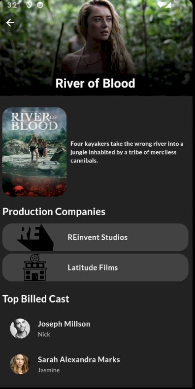

# movie_app

Flutter application that allows users to fetch movie data from The Movie Database (TMDb) API. The app displays a list of movies, their details, and more..

## Setup

### 1. Clone the repository

````bash
git clone <url>
cd movie_app

### 2.Install dependencies

```bash
flutter pub get

### 3. Set up API Key
    - Sign up on TMDb.
    - After logging in, go to the API section and generate a new API key.
    - Create a config.json file under the assets directory in the project.
    - Add your API key in config.json like this:
    ```config.json
    {
      "api_key": "YOUR_API_KEY"
    }
### 4. Add the assets to the pubspec.yaml
Make sure the assets are correctly listed in pubspec.yaml:

```pubspec.yaml
flutter:
assets: - assets/config.json

### Home Page


### Search Page


### Movie Details Page

````
